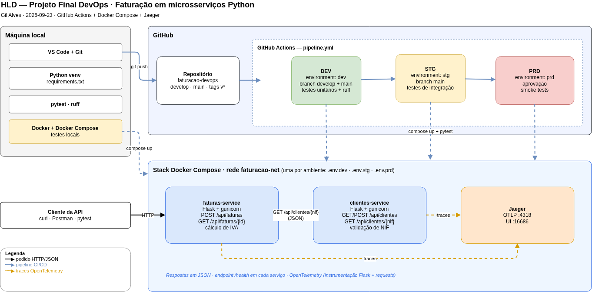

# Projeto Final DevOps — Faturação em Microsserviços Python

**Autor:** Gil Alves · **Curso:** DevOps Engineering — Tokio School
**Repositório:** https://github.com/gil2004/Fatura-o---DevOps

## 1. Introdução

Pipeline de entrega contínua para uma aplicação de faturação com dois microsserviços
Python (Flask), que comunicam por HTTP com respostas em JSON:

- **clientes-service** (5001) — gestão de clientes e validação do NIF.
- **faturas-service** (5002) — emissão de faturas; consulta o clientes-service e calcula o IVA.

Os serviços correm em containers orquestrados com Docker Compose, e as transações
entre eles são rastreadas com Jaeger (OpenTelemetry). O pipeline, em GitHub Actions,
tem três ambientes:

| Branch | Jobs | Testes |
|---|---|---|
| `develop` | DEV | lint (ruff) + testes unitários |
| `main` | DEV → STG → PRD | + integração (STG) + smoke tests e tracing (PRD, com aprovação manual) |

## 2. Arquitetura



## 3. Ferramentas e bibliotecas

| Ferramenta | Utilização |
|---|---|
| Python 3.12 + venv | linguagem e ambiente virtual |
| Flask, requests, gunicorn | APIs, chamadas entre serviços, servidor de produção |
| pytest, pytest-cov, requests-mock | testes, cobertura e simulação de serviços |
| ruff | lint |
| OpenTelemetry (sdk, exporter OTLP, instrumentação Flask e requests) | envio de traces |
| GitHub + GitHub Actions + Environments | repositório e pipeline DEV/STG/PRD |
| Docker + Docker Compose | containers e orquestração |
| Jaeger v2 | visualização dos traces |

## 4. Decisões de design

- **Docker Compose em vez de Kubernetes** — cumpre o requisito com menos complexidade.
- **Branches em vez de tags** — `develop` para trabalho, `main` para entrega; produção
  protegida pela aprovação manual do ambiente `prd`.
- **Testes por fase** — unitários em DEV, integração em STG, smoke em PRD.
- **Mocks nos testes unitários** — cada serviço é testado isoladamente.
- **Dados em memória** — o foco é o pipeline, não a persistência.
- **gunicorn nos containers** — o servidor do Flask é só para desenvolvimento.
- **Tracing ativado por variável de ambiente** — só com `OTEL_EXPORTER_OTLP_ENDPOINT`
  definida; os testes unitários não precisam do Jaeger.
- **Ambientes simulados nos runners** — cada job arranca os containers numa máquina
  nova do GitHub; numa empresa seriam servidores permanentes.

## 5. Passos de implementação

### Passo 1 — Ambiente virtual

```bash
python3 -m venv venv
source venv/bin/activate
pip install -r requirements.txt
```

### Passo 2 — Testes unitários

```bash
cd clientes-service && python3 -m pytest -v --cov=app   # 15 testes, 95%
cd ../faturas-service && python3 -m pytest -v --cov=app  # 9 testes, 91%
```


### Passo 3 — Comunicação entre serviços

Com os dois serviços a correr (`python3 app.py` em cada pasta):

```bash
curl -X POST localhost:5002/api/faturas -H "Content-Type: application/json" \
  -d '{"nif":"501964843","linhas":[{"descricao":"Consultoria","quantidade":2,"preco_unitario":100,"taxa_iva":23}]}'
```

O faturas-service consultou o clientes-service e devolveu a fatura com total de 246.0 €.


### Passo 4 — Repositório local e remoto

```bash
git init
git add .
git commit -m "Microsserviços com testes"
git branch -M main
git remote add origin https://github.com/gil2004/Fatura-o---DevOps.git
git push -u origin main
git checkout -b develop
git push -u origin develop
```

### Passo 5 — Pipeline com DEV, STG e PRD

Em *Settings → Environments* foram criados os ambientes `dev`, `stg` e `prd`
(este com *Required reviewers*). O ficheiro `.github/workflows/pipeline.yml` define:

- **DEV** — lint e testes unitários, em qualquer push;
- **STG** — só na `main`: `docker compose up`, testes de integração, `docker compose down`;
- **PRD** — depois de aprovado: `docker compose up`, smoke tests, `docker compose down`.

```bash
# trabalho → DEV
git checkout develop && git add -A && git commit -m "..." && git push
# entrega → DEV → STG → PRD
git checkout main && git merge develop && git push && git checkout develop
```

### Passo 6 — Containers com Docker Compose

Cada serviço tem um Dockerfile (`python:3.12-slim`, utilizador sem privilégios,
arranque com gunicorn). O `docker-compose.yml` liga os containers na rede
`faturacao-net`, onde o faturas-service chega ao outro por `http://clientes-service:5001`.

```bash
docker compose up -d --build
python3 -m pytest -v tests/integracao   # 3 testes
```

### Passo 7 — Rastreamento com Jaeger

Cada `app.py` tem a função `configurar_tracing()`, que instrumenta o Flask e o
requests e envia os spans ao Jaeger. No `docker-compose.yml` foi acrescentado o
container `jaegertracing/jaeger` e as variáveis `OTEL_SERVICE_NAME` e
`OTEL_EXPORTER_OTLP_ENDPOINT=http://jaeger:4318`.

Em `http://localhost:16686`, cada fatura aparece como um trace com os spans dos dois
serviços; os erros (por exemplo, NIF inexistente → 404) ficam assinalados.

No pipeline, o smoke test `test_trace_chega_ao_jaeger` consulta a API do Jaeger
(`/api/v3/traces`) e só passa se os dois serviços tiverem enviado spans.

```bash
python3 -m pytest -v tests/smoke   # 4 testes
```

### Passo 8 — Paragem, destruição e limpeza

```bash
docker compose down --rmi all -v      # containers, rede, imagens e volumes
docker builder prune -f               # cache de build
docker ps -a && docker images         # confirmar que não resta nada do projeto
deactivate
rm -rf venv .pytest_cache .ruff_cache
find . -name "__pycache__" -type d -exec rm -rf {} +
```

No GitHub, os runners são destruídos automaticamente no fim de cada job. O repositório
e os ambientes mantêm-se por fazerem parte da entrega.

## 6. Evidências

| Teste | Onde | Resultado |
|---|---|---|
| Unitários clientes / faturas | local + DEV | 15 + 9 aprovados |
| Integração | local + STG | 3 aprovados |
| Smoke + tracing | local + PRD | 4 aprovados |
| Trace com os dois serviços | Jaeger | 3 spans no mesmo trace |

## 7. Problemas encontrados

| Problema | Solução |
|---|---|
| `No module named 'app'` ao correr `pytest` | usar `python3 -m pytest` |
| `No module named 'flask'` num terminal novo | ativar o venv em cada terminal |
| Acentos no JSON como `\u00e3` | `app.json.ensure_ascii = False` |
| `git init` feito dentro de `clientes-service` | apagar `clientes-service/.git` e repetir na raiz |
| Ruff diferente no PC e no CI | usar o ruff do venv e `ruff check . --fix` |
| STG falhou: pasta `tests/integracao` não encontrada | a pasta renomeada não entrou no commit; `git add -A` |
| Aviso de Node.js 20 no Actions | `checkout@v5` e `setup-python@v6` |
| `docker build` falhou com `clientes_service` | o nome da pasta é `clientes-service` |
| API do Jaeger devolvia 404 | o Jaeger v2 usa `/api/v3/traces` e não `/api/traces` |


## 8. Utilização de IA

Foi utilizado o Claude (Anthropic) como apoio na proposta de arquitetura, no código
base e na estrutura deste relatório. As decisões, a implementação, os testes e a
resolução dos problemas foram feitos pelo autor.